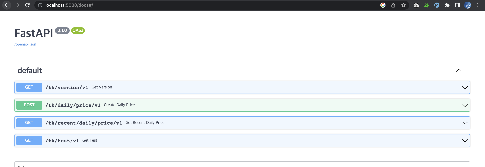

# Ticker
- DDD(Domain Driven Development) server for python.
- Simply save stock price data and return it using RESTful API.
- You can start to track code from app_controller.py
- I use this as a template when developing a real server.
- I use TDD when developing.

# API Spec

- GET /tk/version/v1
    - Return Version of the server
- POST /tk/daily/price/v1
    - Create Daily Price from yahoo finance
- GET /tk/recent/daily/price/v1
    - Get Recent Daily Price saved from yahoo finance
- GET /tk/test/v1
    - Create Daily Price and Get Recent Daily Price

## Applied Design Pattern List
- Hexagonal or Ports(MVC)
    - ticker/entrypoints/app_controller.py
- Adapters
    - ticker/adapters/vendor_proxy.py
- Entities
    - ticker/adapters/orm.py
    - ticker/domain/model.py
- Repository
    - ticker/adapters/repository.py
- Service
    - ticker/service_layer/handlers.py
- The Message Bus and Events
    - ticker/service_layer/messagebus.py
- Commands and Command Handler
    - ticker/domain/commands.py
- Command-Query Responsibility Segregation (CQRS)
    - ticker/service_layer/handlers.py
    - ticker/domain/commands.py
    - ticker/views.py
- Dependency Injection (and Bootstrapping)
    - ticker/bootstrap.py
- TDD (Test-driven development)
    - ticker/tests/e2e/test_vendor_proxy.py
    - ticker/tests/unit/test_handlers.py
    - ticker/tests/integration/test_repository.py

# Function
- Save ticker data from yahoo and Get data
- [Yahoo finance data](https://query1.finance.yahoo.com/v8/finance/chart/005930.KS?interval=1d&range=5d)

# Run server
```shell
docker-compose build
# or, make build

docker-compose up -d
# or, make up
```

# Swagger
```
http://localhost:5080/docs
```

## Requirements
* python 3.10
* docker with docker-compose
* [poetry](https://python-poetry.org/docs/)

## Creating a local dev environment
```shell
export VIRTUAL_ENV=.venv
export VIRTUAL_ENV_PYTHON_VERISON=3.10.2

if [[ ! -d $VIRTUAL_ENV ]]; then
    log_status "no venv found; creating $VIRTUAL_ENV"
    pyenv local $VIRTUAL_ENV_PYTHON_VERISON
    virtualenv -p=$VIRTUAL_ENV_PYTHON_VERISON .venv
    pip install black mypy flake8
fi
. .venv/bin/activate
poetry install
```

## Running the tests
- Local
```shell
pytest tests

# or, if you have a local virtualenv
make unit
make inte
make e2e
```
- In docker
```shell
make up
make test

```

# Reference
- [Architecture Patterns with Python](https://www.cosmicpython.com/book/preface.html)
- [Implementing Domain-Driven Design](https://www.amazon.com/Implementing-Domain-Driven-Design-Vaughn-Vernon/dp/0321834577)
- [cosmic_python](https://www.cosmicpython.com/)
